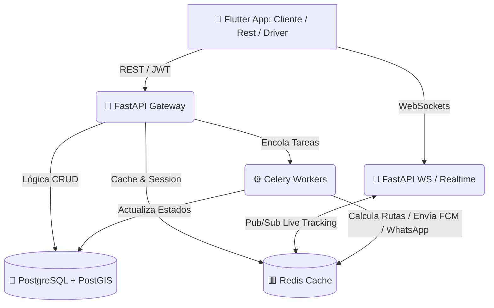
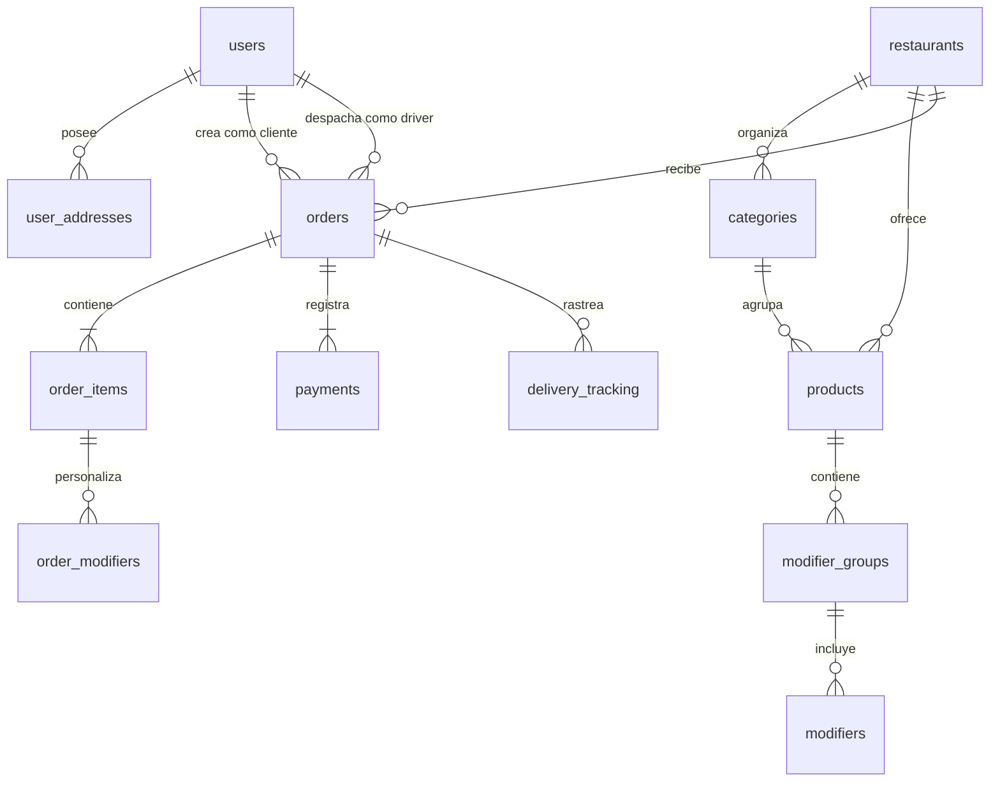
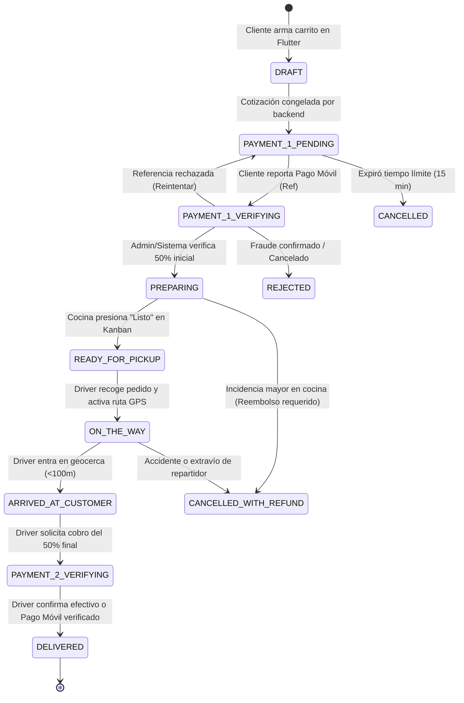
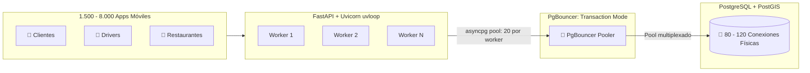

# 🏗️ Arquitectura Avanzada y Modelo de Datos (Delivery San Juan de los Morros)

Este documento define la topología del sistema de alta disponibilidad, el modelo relacional extendido con soporte geoespacial (PostGIS) y la máquina de estados avanzada, cubriendo casos borde y personalización de pedidos.

---

## 1. Diseño del Sistema (Topología Modular)

Para soportar concurrencia y cálculos de rutas sin saturar el hilo principal, el backend de FastAPI se divide lógicamente apoyándose en herramientas en memoria y colas de tareas.



---

## 2. Modelo Relacional y Geoespacial (PostgreSQL + PostGIS)

Todas las tablas utilizan claves primarias de tipo **UUIDv4** y nombres en minúsculas en plural (`snake_case`). Los valores monetarios emplean **`NUMERIC(10, 2)`** para garantizar precisión financiera.



### 2.1. Diccionario de Tablas Principales

#### `users` (Usuarios y Autenticación)
| Columna | Tipo | Restricciones | Descripción |
| :--- | :--- | :--- | :--- |
| `id` | UUID | PK, default `gen_random_uuid()` | Identificador único |
| `phone_number` | VARCHAR(20) | UNIQUE, NOT NULL | Teléfono con código de país (ej. +58414...) |
| `full_name` | VARCHAR(120) | NOT NULL | Nombre y apellido |
| `email` | VARCHAR(120) | NULLABLE, UNIQUE | Correo (obligatorio solo para `SUPER_ADMIN`) |
| `password_hash` | VARCHAR(255) | NULLABLE | Hash bcrypt/argon2 (solo roles administrativos) |
| `role` | VARCHAR(30) | NOT NULL | `CUSTOMER`, `DRIVER`, `RESTAURANT_ADMIN`, `SUPER_ADMIN` |
| `is_active` | BOOLEAN | NOT NULL, default `true` | Estado de la cuenta |
| `created_at` | TIMESTAMP WITH TIME ZONE | NOT NULL, default `NOW()` | Fecha de registro |
| `updated_at` | TIMESTAMP WITH TIME ZONE | NOT NULL, default `NOW()` | Última actualización |

#### `user_addresses` (Direcciones y Coordenadas del Cliente)
| Columna | Tipo | Restricciones | Descripción |
| :--- | :--- | :--- | :--- |
| `id` | UUID | PK | Identificador único |
| `user_id` | UUID | FK `users.id`, NOT NULL | Propietario de la dirección |
| `label` | VARCHAR(50) | NOT NULL | Ej. "Casa", "Trabajo", "Pareja" |
| `address_line` | TEXT | NOT NULL | Sector, calle, urbanización |
| `reference_point` | TEXT | NULLABLE | Ej. "Frente a la plaza, portón verde" |
| `location` | GEOMETRY(Point, 4326) | NOT NULL | Coordenadas PostGIS (Longitud, Latitud) |
| `is_default` | BOOLEAN | NOT NULL, default `false` | Dirección por defecto |

#### `restaurants` (Comercios Afiliados)
| Columna | Tipo | Restricciones | Descripción |
| :--- | :--- | :--- | :--- |
| `id` | UUID | PK | Identificador único |
| `name` | VARCHAR(120) | NOT NULL | Nombre comercial |
| `phone_number` | VARCHAR(20) | NOT NULL | Teléfono de contacto operativo |
| `address` | TEXT | NOT NULL | Dirección física en San Juan de los Morros |
| `location` | GEOMETRY(Point, 4326) | NOT NULL | Coordenadas PostGIS del local para cálculo de rutas |
| `commission_rate` | NUMERIC(5, 2) | NOT NULL, default `15.00` | Comisión porcentual de la plataforma |
| `is_open` | BOOLEAN | NOT NULL, default `true` | Toggle de apertura en vivo |
| `is_active` | BOOLEAN | NOT NULL, default `true` | Habilitación por Super Admin |
| `created_at` | TIMESTAMP WITH TIME ZONE | NOT NULL, default `NOW()` | Fecha de alta |

#### `categories` (Categorías del Menú)
| Columna | Tipo | Restricciones | Descripción |
| :--- | :--- | :--- | :--- |
| `id` | UUID | PK | Identificador único |
| `restaurant_id` | UUID | FK `restaurants.id`, NOT NULL | Restaurante al que pertenece |
| `name` | VARCHAR(100) | NOT NULL | Nombre de la categoría (ej. Hamburguesas) |
| `sort_order` | INTEGER | NOT NULL, default `0` | Orden de visualización en la app |
| `is_active` | BOOLEAN | NOT NULL, default `true` | Visible en el menú |

#### `products` (Platos y Productos)
| Columna | Tipo | Restricciones | Descripción |
| :--- | :--- | :--- | :--- |
| `id` | UUID | PK | Identificador único |
| `restaurant_id` | UUID | FK `restaurants.id`, NOT NULL | Restaurante |
| `category_id` | UUID | FK `categories.id`, NOT NULL | Categoría del menú |
| `name` | VARCHAR(120) | NOT NULL | Nombre del producto |
| `description` | TEXT | NULLABLE | Descripción e ingredientes |
| `base_price` | NUMERIC(10, 2) | NOT NULL | Precio base en USD |
| `image_url` | TEXT | NULLABLE | Fotografía del producto |
| `is_available` | BOOLEAN | NOT NULL, default `true` | Toggle de stock diario |

#### `modifier_groups` y `modifiers` (Opciones y Extras)
*   **`modifier_groups`**: `id` (UUID), `product_id` (FK), `name` (VARCHAR), `min_selectable` (INT, default 0), `max_selectable` (INT, default 1), `is_required` (BOOL).
*   **`modifiers`**: `id` (UUID), `group_id` (FK), `name` (VARCHAR), `extra_price` (NUMERIC(10, 2), default 0.00), `is_available` (BOOL).

#### `orders` (Maestro de Pedidos)
| Columna | Tipo | Restricciones | Descripción |
| :--- | :--- | :--- | :--- |
| `id` | UUID | PK | Identificador único |
| `order_number` | VARCHAR(20) | UNIQUE, NOT NULL | Código legible (ej. `SJM-2026-0089`) |
| `customer_id` | UUID | FK `users.id`, NOT NULL | Cliente que ordenó |
| `restaurant_id` | UUID | FK `restaurants.id`, NOT NULL | Comercio que cocina |
| `driver_id` | UUID | FK `users.id`, NULLABLE | Repartidor asignado |
| `delivery_address_id` | UUID | FK `user_addresses.id`, NOT NULL | Dirección destino |
| `status` | VARCHAR(35) | NOT NULL | Estado actual de la máquina de estados |
| `subtotal_amount` | NUMERIC(10, 2) | NOT NULL | Suma de productos y extras |
| `delivery_fee` | NUMERIC(10, 2) | NOT NULL | Tarifa de envío por distancia PostGIS |
| `platform_fee` | NUMERIC(10, 2) | NOT NULL | Tarifa fija de servicio de la plataforma |
| `total_amount` | NUMERIC(10, 2) | NOT NULL | Monto total (`subtotal + delivery + platform`) |
| `first_half_amount` | NUMERIC(10, 2) | NOT NULL | Pago 1: `ceil(total_amount / 2 * 100) / 100` |
| `second_half_amount`| NUMERIC(10, 2) | NOT NULL | Pago 2: `total_amount - first_half_amount` |
| `delivery_distance_m`| NUMERIC(10, 2) | NOT NULL | Distancia en metros calculada por PostGIS |
| `cancellation_reason`| TEXT | NULLABLE | Motivo de rechazo o cancelación |
| `created_at` | TIMESTAMP WITH TIME ZONE | NOT NULL, default `NOW()` | Creación |
| `updated_at` | TIMESTAMP WITH TIME ZONE | NOT NULL, default `NOW()` | Última actualización |

#### `payments` (Registro del Ledger Financiero)
| Columna | Tipo | Restricciones | Descripción |
| :--- | :--- | :--- | :--- |
| `id` | UUID | PK | Identificador del pago |
| `order_id` | UUID | FK `orders.id`, NOT NULL | Pedido asociado |
| `phase` | VARCHAR(20) | NOT NULL | `FIRST_HALF` (50% inicial) o `SECOND_HALF` (50% final) |
| `method` | VARCHAR(30) | NOT NULL | `PAGO_MOVIL`, `CASH_USD`, `CASH_VES`, `BINANCE_PAY` |
| `amount` | NUMERIC(10, 2) | NOT NULL | Monto exacto cobrado |
| `status` | VARCHAR(20) | NOT NULL | `PENDING`, `VERIFIED`, `REJECTED` |
| `reference_number` | VARCHAR(50) | NULLABLE | Número de referencia bancaria reportada |
| `origin_bank` | VARCHAR(50) | NULLABLE | Banco emisor (BDV, Banesco, Mercantil, etc.) |
| `proof_image_url` | TEXT | NULLABLE | Comprobante visual capturado |
| `verified_by` | UUID | FK `users.id`, NULLABLE | Admin o driver que validó el pago |
| `verified_at` | TIMESTAMP WITH TIME ZONE | NULLABLE | Momento de verificación |
| `created_at` | TIMESTAMP WITH TIME ZONE | NOT NULL, default `NOW()` | Momento del reporte |

#### `delivery_tracking` (Trazabilidad GPS Persistente)
| Columna | Tipo | Restricciones | Descripción |
| :--- | :--- | :--- | :--- |
| `id` | UUID | PK | Identificador |
| `order_id` | UUID | FK `orders.id`, NOT NULL | Pedido en curso |
| `driver_id` | UUID | FK `users.id`, NOT NULL | Conductor |
| `location` | GEOMETRY(Point, 4326) | NOT NULL | Coordenadas históricas cada 3 min o hito |
| `battery_level` | INTEGER | NULLABLE | Nivel de batería del teléfono (diagnóstico) |
| `recorded_at` | TIMESTAMP WITH TIME ZONE | NOT NULL, default `NOW()` | Marca de tiempo |

#### `audit_logs` (Seguridad y Pista de Auditoría)
Guarda `id`, `admin_user_id`, `action` (ej. `VERIFY_PAYMENT_1`, `CANCEL_ORDER`), `entity_name`, `entity_id`, `details` (JSONB con valores anteriores y nuevos), `ip_address` y `created_at`.

---

## 3. Máquina de Estados Global del Pedido (`OrderStatus`)

El ciclo de vida del pedido es estricto e irreversible hacia atrás (salvo cancelaciones justificadas con compensación documentada).



### 3.1. Transiciones y Casos Borde
1.  **Protección de Cocina:** Ningún restaurante recibe notificación de orden antes del estado `PREPARING`.
2.  **Protección de Entrega:** La aplicación del repartidor bloquea el botón "Completar Entrega" (`DELIVERED`) hasta que `payments` registre el segundo 50% en estado `VERIFIED`.
3.  **Cancelación en Preparación o Camino:** Si ocurre una contingencia (ej. corte eléctrico en local o avería de moto), la orden pasa a `CANCELLED_WITH_REFUND`, notificando a `SUPER_ADMIN` con prioridad máxima para generar la transacción compensatoria del 50% verificado.

---

## 4. Arquitectura de Alta Concurrencia y Escalamiento (1.500 a 8.000 Usuarios)

Para soportar picos de alta demanda en San Juan de los Morros (almuerzos de 12:00 a 14:00 y cenas de 19:00 a 21:30) con entre **1.500 usuarios concurrentes promedio y picos de hasta 8.000 usuarios activos simultáneos**, la arquitectura implementa controles estrictos de concurrencia y pooling.

### 4.1. SLAs y Métricas de Rendimiento Bajo Carga
*   **Latencia API REST:** Percentil 95 ($p_{95}$) $< 200\text{ ms}$ para endpoints de lectura y $< 300\text{ ms}$ para checkout.
*   **Distribución WebSocket:** Latencia de entrega de coordenadas $< 50\text{ ms}$.
*   **Tasa de Error:** $0.0\%$ de errores a 1.500 CCU (*Concurrent Connected Users*) y $< 0.1\%$ a 8.000 CCU.

### 4.2. Topología de Conexiones: PgBouncer + Async Connection Pooling
PostgreSQL maneja conexiones mediante procesos del sistema operativo (cada proceso reserva entre 5 y 10 MB de RAM). Abrir 8.000 conexiones directas provocaría una caída catastrófica del servidor por agotamiento de memoria.



*   **Configuración de PgBouncer:**
    *   Modo de agrupación: `pool_mode = transaction`.
    *   Conexiones de cliente aceptadas: `max_client_conn = 10000`.
    *   Pool de conexiones reales a Postgres: `default_pool_size = 100`, `reserve_pool_size = 20`.
*   **Configuración en FastAPI (`asyncpg`):**
    *   `min_size = 10`, `max_size = 25` conexiones por worker Uvicorn.
    *   Reutilización de conexiones sin handshake repetitivo.

### 4.3. Capa de Caché Estratégica en Redis (Amortiguador de Lecturas)
El 80% del tráfico en horas pico corresponde a exploración pasiva del menú y listado de restaurantes. Para proteger la base de datos:
1.  **Caché de Restaurantes y Catálogos:**
    *   Clave: `cache:restaurants:active` y `cache:menu:{restaurant_id}` (JSON serializado con compresión ligera).
    *   TTL: 10 minutos con invalidación reactiva por eventos.
    *   **Invalidación Inmediata:** Si un restaurante apaga un plato en su Kanban o cambia precios, FastAPI ejecuta `DEL cache:menu:{restaurant_id}` y publica el evento en Redis.
2.  **Caché de Distancias Frecuentes:**
    *   Cálculos espaciales de PostGIS para sectores comunes de San Juan de los Morros (ej. Casco Central hacia Los Rosales, La Morera, Rómulo Gallegos) cacheados con clave geo-hash para evitar re-ejecutar `ST_DistanceSphere` en cada navegación.

### 4.4. Mitigación de Condiciones de Carrera (Race Conditions)

#### 1. Doble Asignación de Repartidores (Concurrencia de Despacho)
**Problema:** Al marcar una orden como `READY_FOR_PICKUP`, decenas de repartidores reciben la alerta en sus teléfonos. Si dos repartidores pulsan "Aceptar Pedido" simultáneamente, ambos podrían creerse asignados.
**Solución Inquebrantable:** Actualización atómica con condición de guarda a nivel de fila SQL:
```sql
UPDATE orders
SET driver_id = :driver_id,
    status = 'ON_THE_WAY',
    updated_at = NOW()
WHERE id = :order_id
  AND driver_id IS NULL
  AND status = 'READY_FOR_PICKUP'
RETURNING id;
```
*   Si la consulta retorna el `id`, la asignación fue exitosa y se notifica al repartidor.
*   Si la consulta retorna 0 filas, el backend responde inmediatamente `HTTP 409 Conflict`:
    ```json
    {
      "success": false,
      "error_code": "ORDER_ALREADY_ASSIGNED",
      "message": "Este pedido ya fue tomado por otro conductor.",
      "data": null
    }
    ```

#### 2. Idempotencia Financiera (Pagos Duplicados)
**Problema:** Un cliente con señal inestable en San Juan de los Morros presiona varias veces "Enviar Pago" o la app reintenta la petición HTTP en segundo plano.
**Solución:**
*   Cabecera obligatoria: `X-Idempotency-Key` (UUIDv4 generado por la app cliente antes del envío).
*   FastAPI ejecuta un `SET idempotency:{key} "PROCESSING" EX 120 NX` en Redis:
    *   Si devuelve `False`, la petición ya está en curso o fue procesada; el backend devuelve la respuesta almacenada o un código `HTTP 429` / `409`.
    *   Una vez verificado el reporte, se guarda el resultado del pago en la clave de idempotencia con TTL de 24 horas.

#### 3. Control de Sobreventa de Stock
Para productos con stock limitado:
```sql
UPDATE products
SET stock = stock - :quantity,
    updated_at = NOW()
WHERE id = :product_id
  AND is_available = true
  AND stock >= :quantity
RETURNING stock;
```
Si el stock resultante es 0, un disparador o evento en la API actualiza `is_available = false` e invalida la caché del menú.

### 4.5. Escalado Horizontal de WebSockets (Tracking en Vivo)
*   Las instancias de FastAPI no mantienen estado local de WebSockets en memoria ram de la máquina.
*   Toda publicación de coordenadas (`WS /ws/driver/track`) se emite al bus de **Redis Pub/Sub** (`order:{id}:location`).
*   Cualquier worker de FastAPI suscrito al canal reenvía el paquete WebSocket a la app cliente conectada, permitiendo balancear la carga entre múltiples contenedores detrás de Nginx / Traefik sin problemas de afinidad de sesiones.