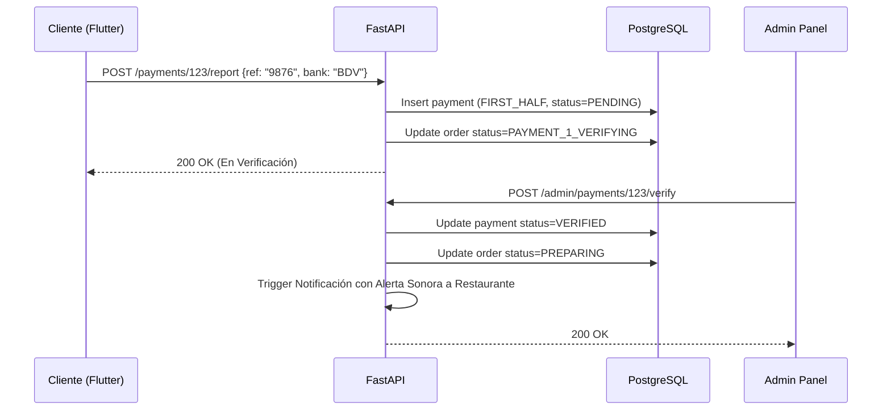
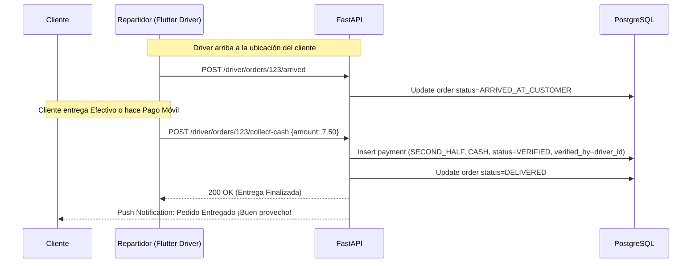

# 🛒 Especificación de Checkout y Regla de Pago 50/50

Este documento define la inmutabilidad del carrito, el motor de cálculo de precios en el backend y la máquina de estados estricta para la verificación del modelo de pago fraccionado (50% anticipado / 50% contra entrega).

---

## 1. Gestión del Carrito (Resiliencia Offline)

Para evitar frustraciones si el cliente pierde conexión navegando por el menú:
1.  **Estado Local:** Flutter almacena el carrito en la base de datos local (Hive/Isar). 
2.  **Validación Pre-Checkout:** Al presionar "Ir a Pagar", Flutter envía un payload (lista de `product_id`, `quantity`, `modifier_ids`) al endpoint `POST /orders/draft`.
3.  **Cotización del Servidor:** FastAPI calcula el precio real basado en la base de datos (ignorando cualquier precio que mande Flutter para evitar hackeos) y calcula el costo de envío usando PostGIS (distancia entre el restaurante y el `user_addresses` seleccionado).
4.  **Respuesta:** El backend devuelve el `DRAFT` con los montos exactos y bloquea los precios de esos ítems para esta orden durante 15 minutos.

---

## 2. Motor de Cálculo Financiero (El Ledger)

Todos los cálculos monetarios deben usar el tipo de dato `Decimal` en Python y `Numeric(10, 2)` en PostgreSQL. **Prohibido usar `Float` o `Double`.**

### 2.1. Fórmula del Total
$$\text{total\_amount} = \sum(\text{items\_base\_price}) + \sum(\text{modifiers\_price}) + \text{delivery\_fee} + \text{platform\_fee}$$

### 2.2. División Matemática Asimétrica (Regla del Centavo)
Es matemáticamente imposible dividir ciertos números (ej. $15.01) exactamente en dos sin perder o inventar fracciones de centavo.
*   **Regla de Redondeo:** El pago inicial (`FIRST_HALF`) siempre absorbe el centavo impar redondeando hacia arriba.
*   **Fórmula Backend:**
    *   `FIRST_HALF_AMOUNT = ceil(total_amount / 2 * 100) / 100`
    *   `SECOND_HALF_AMOUNT = total_amount - FIRST_HALF_AMOUNT`
*   *Ejemplo para $15.01:* Primer pago = $7.51. Segundo pago = $7.50.

---

## 3. Flujo del Primer Pago (El 50% Inicial)

Ningún restaurante debe recibir notificación de un pedido hasta que este flujo se complete y el pago esté verificado.

### 3.1. Reporte del Cliente (Pago Móvil / Transferencia)
1.  Flutter muestra la pantalla de pago indicando **únicamente** el monto `FIRST_HALF_AMOUNT`.
2.  El cliente realiza el Pago Móvil en su app bancaria hacia las cuentas oficiales de la plataforma.
3.  El cliente ingresa en Flutter: `Banco Origen`, `Últimos 4 o 6 dígitos de Referencia` y opcionalmente sube un `Capture (Imagen)`.
4.  Flutter envía esto a `POST /payments/{order_id}/report`. El estado de la orden pasa a `PAYMENT_1_VERIFYING`.

### 3.2. Verificación y Desbloqueo de Cocina
1.  El `SUPER_ADMIN` (o el servicio automatizado de conciliación) verifica que el dinero ingresó a la cuenta bancaria.
2.  Se llama al endpoint `POST /admin/payments/{payment_id}/verify`.
3.  **Transición de Estado:** 
    *   El pago se marca como `VERIFIED`.
    *   La orden pasa a estado `PREPARING`.
    *   Se dispara un Webhook/Push Notification con alerta sonora al `RESTAURANT_ADMIN` para que empiece a cocinar.

### Diagrama de Secuencia del Primer Pago

---

## 4. Flujo del Segundo Pago (El 50% Final Contra Entrega)

El segundo 50% (`SECOND_HALF_AMOUNT`) se liquida en el momento exacto en que el repartidor llega al destino del cliente.

### 4.1. Métodos de Cobro Permitidos en Puerta
1.  **Efectivo en Divisas (USD Cash):** El cliente entrega el monto exacto en dólares en buen estado.
2.  **Efectivo en Bolívares (VES Cash):** Calculado a la tasa oficial del día fijada al momento de crear el pedido.
3.  **Pago Móvil en Sitio:** El cliente realiza el Pago Móvil al llegar el repartidor y le muestra el comprobante en su pantalla.

### 4.2. Operatoria del Repartidor (App Flutter Driver)
1.  Al ingresar en la geocerca de proximidad (<100m) o notificar llegada (`ARRIVED_AT_CUSTOMER`), la app del conductor habilita la interfaz de cobro.
2.  La pantalla del repartidor indica con precisión el saldo pendiente: `SECOND_HALF_AMOUNT`.
3.  **Acciones del Driver:**
    *   **Si cobró Efectivo:** El repartidor presiona **[Confirmar Cobro Efectivo]** (`POST /driver/orders/{order_id}/collect-cash`).
    *   **Si cobró por Pago Móvil en sitio:** El repartidor ingresa los últimos 4 dígitos de la referencia bancaria y presiona **[Confirmar Pago Móvil en Sitio]** (`POST /driver/orders/{order_id}/confirm-digital`).
4.  **Cierre Inquebrantable:** El backend valida el registro en `payments` (`phase=SECOND_HALF`, `status=VERIFIED`, `verified_by=driver_id`) y actualiza el estado de la orden a `DELIVERED`. **Bajo ninguna circunstancia la app del repartidor puede marcar `DELIVERED` si el segundo 50% no está formalmente verificado.**

### Diagrama de Secuencia del Segundo Pago

---

## 5. Políticas de Cancelación, Contingencias y Reembolsos

1.  **Cancelación Pre-Pago 1 (`DRAFT` o `PAYMENT_1_PENDING`):**
    *   Si el cliente desiste o transcurren los 15 minutos de tolerancia, el borrador pasa a `CANCELLED` automáticamente. No se genera ningún movimiento financiero.
2.  **Rechazo por el Restaurante o Contingencia (`PREPARING`):**
    *   Si el restaurante se queda sin insumos o experimenta una falla eléctrica/técnica en San Juan de los Morros y no puede despachar, presiona **[Rechazar / Cancelar Orden]**.
    *   La orden pasa inmediatamente al estado crítico `CANCELLED_WITH_REFUND`.
    *   La consola del `SUPER_ADMIN` activa una alerta prioritaria en pantalla.
    *   El Super Admin gestiona el reembolso del primer 50% al cliente mediante Pago Móvil compensatorio y registra el comprobante en `POST /admin/refunds/{order_id}` para cerrar la auditoría contable.
3.  **Desistimiento Injustificado del Cliente en Puerta (`ARRIVED_AT_CUSTOMER`):**
    *   Si el cliente se niega a recibir la comida o no responde en el punto de entrega tras 15 minutos de espera documentada por el repartidor, la comida es devuelta o desechada según política sanitaria.
    *   El primer 50% **no se reembolsa**, sirviendo para cubrir el costo de los alimentos cocinados por el restaurante y la tarifa de desplazamiento del repartidor.