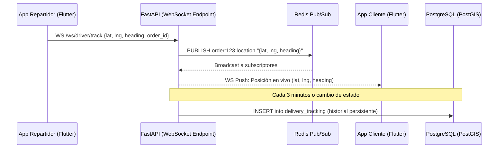

# 🛵 Especificación de Seguimiento en Vivo y Geolocalización

Este documento define la arquitectura de comunicación en tiempo real (WebSockets), el uso de Redis para el almacenamiento efímero de coordenadas GPS, las reglas de geo-cercas (*geo-fencing*) y la resiliencia ante pérdida de señal en la app del repartidor.

---

## 1. Arquitectura de Tiempo Real (WebSockets + Redis Pub/Sub)

Para evitar saturar la base de datos PostgreSQL con miles de inserciones de coordenadas GPS por segundo, el sistema utiliza una arquitectura basada en memoria volátil:

### 1.1. Canal de Publicación Efímero
*   **Clave en Redis:** `order:{order_id}:driver_location` con expiración automática (TTL) de 10 minutos desde el último ping.
*   **Tasa de muestreo en tránsito:** 1 transmisión cada 5 a 10 segundos (o cambio de posición mayor a 15 metros).

---

## 2. Reglas de Geo-Cercas (*Geo-Fencing*)

El sistema calcula dinámicamente la distancia euclidiana/esférica (ST_DistanceSphere en PostGIS o cálculo local Haversine) entre la coordenada del repartidor y los puntos de interés.

### 2.1. Geo-Cerca del Restaurante (Radio de 100 metros)
*   **Evento:** El repartidor se aproxima a menos de 100 metros de `restaurants.location`.
*   **Acción:** La app del repartidor resalta el botón **[He llegado al Local]**. El restaurante visualiza en su Kanban que el conductor está en puerta.

### 2.2. Geo-Cerca del Cliente (Radio de 100 metros)
*   **Evento:** El repartidor se encuentra a menos de 100 metros de `user_addresses.location`.
*   **Acción Automática:**
    1.  El backend transiciona la orden a `ARRIVED_AT_CUSTOMER`.
    2.  Se dispara una Notificación Push prioritaria al cliente:
        > *"🛵 Tu repartidor está llegando con tu pedido. Ten a la mano el pago restante si aplica."*
    3.  En la app del conductor se desbloquea automáticamente la interfaz de cobro del segundo 50% (`SECOND_HALF_AMOUNT`).

---

## 3. Resiliencia de Red y Búfer Local de Coordenadas (App Repartidor)

Dadas las fluctuaciones de red móvil en diferentes sectores de San Juan de los Morros:

### 3.1. Modo Desconectado (Búfer FIFO)
1.  Si el WebSocket del repartidor pierde conexión o la red celular cae en tránsito:
    *   La app de Flutter Driver continúa leyendo el sensor GPS mediante `geolocator`.
    *   Las coordenadas se encolan en una lista en memoria (búfer FIFO limitado a los últimos 50 puntos).
2.  **Reconexión:** Al restablecerse la conectividad móvil:
    *   La app del conductor transmite el punto más reciente de inmediato por WebSocket.
    *   Envía el lote comprimido de puntos anteriores para no perder el histórico en la base de datos.

### 3.2. Experiencia del Cliente ante Caída de Señal
*   Si la app del cliente no recibe un ping de ubicación del repartidor por más de **45 segundos**:
    *   El mapa mantiene el último marcador visible en tono atenuado.
    *   Muestra un aviso no intrusivo: *"Actualizando ubicación del repartidor..."*.
    *   Nunca arroja un error bloqueante en pantalla ni cierra la vista de seguimiento.

---

## 4. Perfiles de Consumo de Batería y Muestreo GPS

Para preservar la batería del dispositivo del repartidor durante turnos prolongados de trabajo:

| Estado del Repartidor | Precisión GPS (`geolocator`) | Frecuencia de Muestreo | Distancia Mínima de Filtro |
| :--- | :--- | :--- | :--- |
| **Inactivo / Esperando Asignación** | `LocationAccuracy.low` | Cada 60 segundos | 100 metros |
| **Hacia el Restaurante** | `LocationAccuracy.medium` | Cada 15 segundos | 30 metros |
| **En Ruta al Cliente (`ON_THE_WAY`)** | `LocationAccuracy.high` | Cada 5 - 10 segundos | 15 metros |